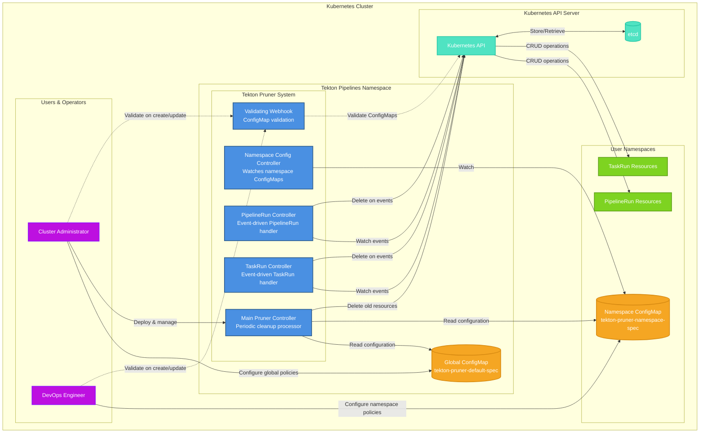
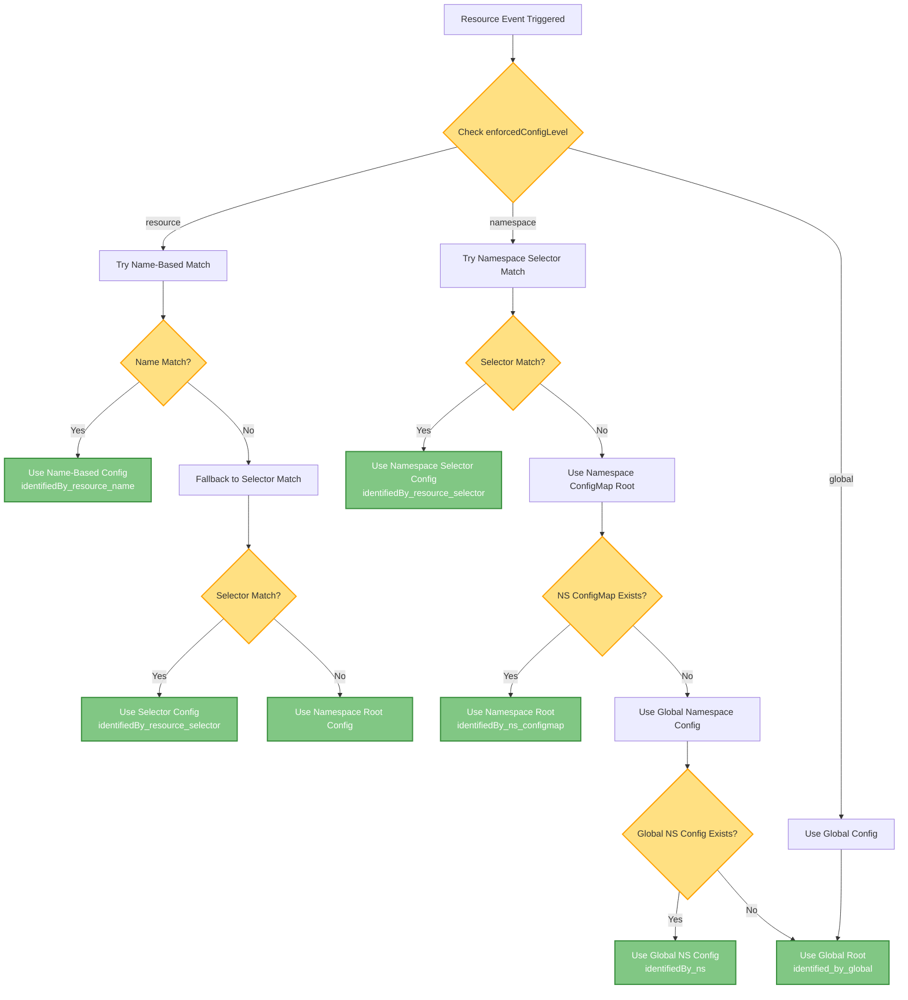
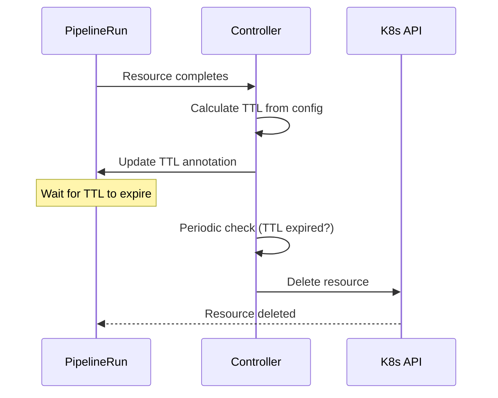
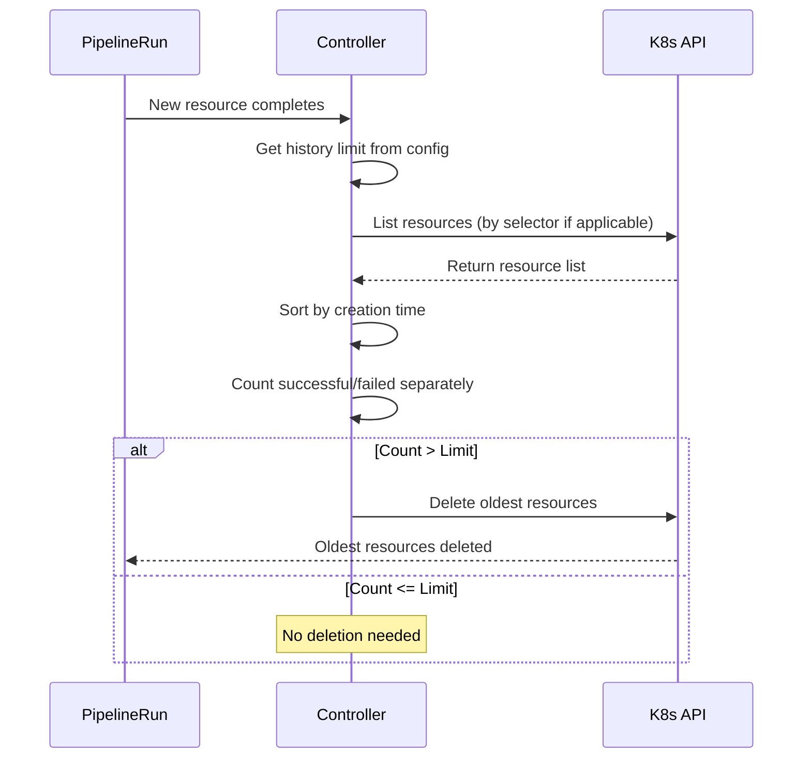
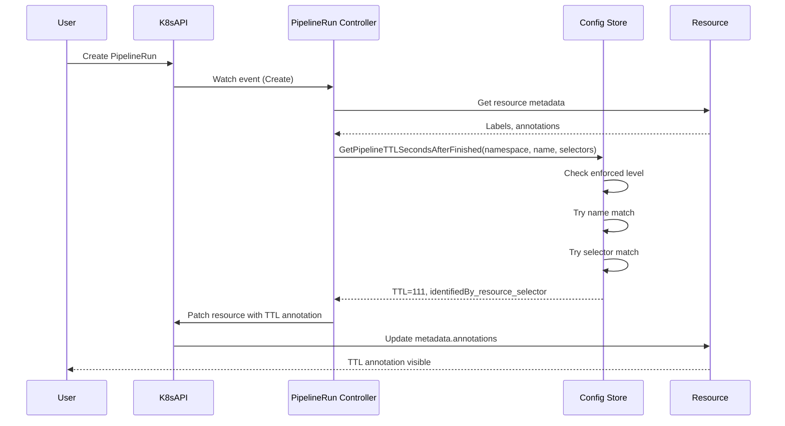
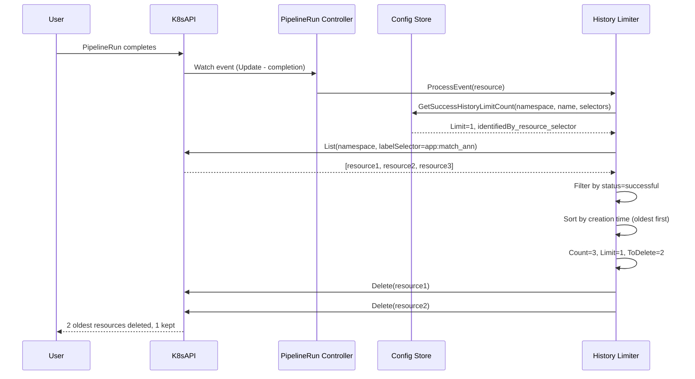

# Tekton Pruner Architecture

## Overview

The Tekton Pruner is a Kubernetes operator that automatically manages the lifecycle of Tekton PipelineRun and TaskRun resources. It provides flexible, multi-level configuration options for both time-based (TTL) and history-based pruning policies.

---

## System Architecture



---

## Components

### 1. Controllers

#### Main Pruner Controller
- **Purpose**: Periodic cleanup processor for TTL-based pruning
- **Trigger**: Timer-based (runs periodically)
- **Responsibilities**:
  - Scans all namespaces for PipelineRuns and TaskRuns
  - Evaluates TTL expiration based on completion time
  - Deletes expired resources
  - Reads configuration from both global and namespace ConfigMaps

#### PipelineRun Controller
- **Purpose**: Event-driven handler for PipelineRun lifecycle
- **Trigger**: Kubernetes events (Create, Update, Delete)
- **Responsibilities**:
  - Updates TTL annotations on PipelineRuns
  - Applies history-based limits (successful/failed)
  - Deletes oldest PipelineRuns when limits exceeded
  - Respects selector-based configurations

#### TaskRun Controller
- **Purpose**: Event-driven handler for TaskRun lifecycle
- **Trigger**: Kubernetes events (Create, Update, Delete)
- **Responsibilities**:
  - Updates TTL annotations on TaskRuns
  - Applies history-based limits (successful/failed)
  - Deletes oldest TaskRuns when limits exceeded
  - Respects selector-based configurations

#### Namespace Config Controller
- **Purpose**: Watches namespace-level ConfigMaps
- **Trigger**: ConfigMap events in watched namespaces
- **Responsibilities**:
  - Loads namespace-specific configurations
  - Validates ConfigMap structure
  - Updates in-memory configuration store
  - Triggers reconciliation when config changes

#### Validating Webhook
- **Purpose**: ConfigMap validation on create/update
- **Trigger**: Admission webhook requests
- **Responsibilities**:
  - Validates ConfigMap YAML structure
  - Ensures selector support rules (namespace only, not global)
  - Prevents invalid configurations from being applied
  - Returns validation errors to users

---

### 2. Configuration

#### Global ConfigMap (`tekton-pruner-default-spec`)
- **Location**: `tekton-pipelines` namespace
- **Managed by**: Cluster Administrators
- **Scope**: Cluster-wide defaults
- **Key Fields**:
  - `enforcedConfigLevel`: Controls config hierarchy (global, namespace, resource)
  - `ttlSecondsAfterFinished`: Global default TTL
  - `successfulHistoryLimit`: Global default for successful runs
  - `failedHistoryLimit`: Global default for failed runs
  - `namespaces`: Per-namespace defaults (selectors NOT supported here)

**Example**:
```yaml
apiVersion: v1
kind: ConfigMap
metadata:
  name: tekton-pruner-default-spec
  namespace: tekton-pipelines
data:
  global-config: |
    enforcedConfigLevel: namespace
    ttlSecondsAfterFinished: 3600
    successfulHistoryLimit: 5
    failedHistoryLimit: 3
```

#### Namespace ConfigMap (`tekton-pruner-namespace-spec`)
- **Location**: User namespaces (e.g., `dev`, `prod`, `test`)
- **Managed by**: DevOps Engineers / Namespace Owners
- **Scope**: Namespace-specific policies
- **Key Fields**:
  - Root-level: Namespace defaults
  - `pipelineRuns`: Array of selector-based configs
  - `taskRuns`: Array of selector-based configs
  - `selector`: Match resources by labels and/or annotations

**Example**:
```yaml
apiVersion: v1
kind: ConfigMap
metadata:
  name: tekton-pruner-namespace-spec
  namespace: dev
data:
  ns-config: |
    ttlSecondsAfterFinished: 1800
    successfulHistoryLimit: 10
    pipelineRuns:
      - selector:
        - matchLabels:
            app: critical
        ttlSecondsAfterFinished: 7200
        successfulHistoryLimit: 20
      - selector:
        - matchAnnotations:
            team: platform
        ttlSecondsAfterFinished: 600
        successfulHistoryLimit: 3
```

---

### 3. Resources

#### PipelineRun Resources
- **Lifecycle**: Created by Tekton Pipelines, managed by Tekton Pruner
- **Annotations Added by Pruner**:
  - `pruner.tekton.dev/ttlSecondsAfterFinished`: TTL value (auto-updated)
  - `pruner.tekton.dev/historyLimitCheckProcessed`: Last history check timestamp
- **Labels/Annotations Used for Matching**:
  - User-defined labels (e.g., `app`, `env`, `team`)
  - User-defined annotations (e.g., `version`, `owner`)

#### TaskRun Resources
- **Lifecycle**: Created by Tekton Pipelines, managed by Tekton Pruner
- **Annotations Added by Pruner**:
  - Same as PipelineRun
- **Labels/Annotations Used for Matching**:
  - User-defined labels
  - User-defined annotations

---

## Configuration Hierarchy

### Precedence Rules

When determining which configuration to apply to a resource, the pruner follows this hierarchy:



### Enforcement Levels

| Level | Description | Config Source | Selector Support |
|-------|-------------|---------------|------------------|
| `global` | Cluster-wide only | Global ConfigMap root | ❌ No |
| `namespace` | Namespace-level | Namespace ConfigMap (with selector support) | ✅ Yes |
| `resource` | Per-resource annotations | Resource annotations + namespace fallback | ✅ Yes (for fallback) |

---

## Selector Matching

### How Selectors Work

Selectors allow fine-grained control over pruning policies by matching resources based on their labels and/or annotations.

#### Matching Logic (AND)

When a selector specifies both `matchLabels` AND `matchAnnotations`, **BOTH** must match for the selector to apply:

```yaml
selector:
  - matchLabels:
      app: myapp
      env: production
    matchAnnotations:
      team: platform
      version: v2
```

**Match Requirements**:
- Resource must have label `app=myapp` ✅
- Resource must have label `env=production` ✅
- Resource must have annotation `team=platform` ✅
- Resource must have annotation `version=v2` ✅
- All 4 must be true for selector to match

#### Multiple Selectors (OR)

A ConfigMap can define multiple selectors (OR logic across selectors):

```yaml
pipelineRuns:
  - selector:
    - matchLabels:
        app: critical
    ttlSecondsAfterFinished: 7200
  - selector:
    - matchAnnotations:
        team: platform
    ttlSecondsAfterFinished: 3600
```

**Evaluation**:
1. Try first selector: Does resource have `app=critical` label?
   - Yes → Use TTL=7200
   - No → Continue to next selector
2. Try second selector: Does resource have `team=platform` annotation?
   - Yes → Use TTL=3600
   - No → Fallback to namespace root config

#### Bug Fixes Applied

**Bug #1**: Reversed selector matching
- **Before**: Checked if ConfigMap requirements existed in resource (wrong direction)
- **After**: Checks if resource has all ConfigMap requirements (correct)

**Bug #2**: History limiter ignoring selectors
- **Before**: Listed ALL resources in namespace for namespace enforcement level
- **After**: Filters resources by selector labels when `identifiedBy_resource_selector`

**Bug #3**: Name-based matching blocking selector fallback
- **Before**: Returned `nil` immediately when name didn't match, blocking selector evaluation
- **After**: Falls through to selector matching when name doesn't match

---

## Pruning Strategies

### 1. TTL-Based Pruning (Time-to-Live)

**Purpose**: Automatically delete completed resources after a specified time

**Configuration**:
```yaml
ttlSecondsAfterFinished: 3600  # Delete after 1 hour
```

**Flow**:


**TTL Calculation**:
- Completion Time: `status.completionTime`
- TTL: From configuration (selector > namespace > global)
- Deletion Time: `completionTime + ttlSecondsAfterFinished`

**Example**:
```
Completion Time: 2025-11-16T16:00:00Z
TTL: 3600 seconds (1 hour)
Deletion Time: 2025-11-16T17:00:00Z
```

### 2. History-Based Pruning (Count Limits)

**Purpose**: Keep only the N most recent resources of each type (successful/failed)

**Configuration**:
```yaml
successfulHistoryLimit: 5  # Keep 5 most recent successful runs
failedHistoryLimit: 3      # Keep 3 most recent failed runs
```

**Flow**:


**Separate Tracking**:
- Successful runs: Tracked independently
- Failed runs: Tracked independently
- Deletion: Only deletes resources exceeding their respective limits

---

## Code Structure

### Key Files

```
pkg/config/
├── config.go                      # Core configuration logic
│   ├── prunerConfigStore          # Singleton config store
│   ├── GetPipelineTTLSecondsAfterFinished()
│   ├── GetPipelineSuccessHistoryLimitCount()
│   ├── getFromPrunerConfigResourceLevelwithSelector()  # Selector matching
│   └── getResourceFieldData()     # Config hierarchy resolver
│
├── history_limiter.go             # History-based pruning
│   ├── ProcessEvent()             # Entry point for history limits
│   └── doResourceCleanup()        # Deletes oldest resources
│
├── ttl_handler.go                 # TTL-based pruning
│   ├── ProcessEvent()             # Entry point for TTL
│   ├── updateAnnotationTTLSeconds()  # Updates TTL annotation
│   ├── needsCleanup()             # Checks if TTL expired
│   └── removeResource()           # Deletes expired resource
│
├── config_selector_test.go        # Selector matching tests
├── config_validation_test.go      # ConfigMap validation tests
└── helper.go                      # Utility functions

pkg/reconciler/
├── pipelinerun/
│   └── reconciler.go              # PipelineRun controller
│
├── taskrun/
│   └── reconciler.go              # TaskRun controller
│
├── namespaceprunerconfig/
│   └── reconciler.go              # Namespace ConfigMap controller
│
└── tektonpruner/
    └── reconciler.go              # Main pruner controller

pkg/webhook/
└── configmapvalidation.go         # Validating webhook
```

---

## Data Flow

### TTL Annotation Update Flow



### History Limit Cleanup Flow



---

## Monitoring & Observability

### Metrics

The pruner exposes Prometheus metrics for monitoring:

| Metric | Type | Description |
|--------|------|-------------|
| `pruner_resources_deleted_total` | Counter | Total resources deleted |
| `pruner_cleanup_duration_seconds` | Histogram | Time taken for cleanup operations |
| `pruner_resources_age_seconds` | Histogram | Age of deleted resources |
| `pruner_config_reloads_total` | Counter | Number of config reloads |

### Logging

Log levels:
- **INFO**: Normal operations (reconciliation success, config updates)
- **DEBUG**: Detailed flow (selector matching, TTL calculations)
- **ERROR**: Failures (delete errors, config validation failures)

**Enable debug logging**:
```yaml
apiVersion: v1
kind: ConfigMap
metadata:
  name: config-logging-tekton-pruner
  namespace: tekton-pipelines
data:
  loglevel.tekton-pruner-controller: debug
```

---

## Best Practices

### Configuration Design

1. **Use Selectors for Fine-Grained Control**:
   ```yaml
   pipelineRuns:
     - selector:
       - matchLabels:
           app: critical
       ttlSecondsAfterFinished: 86400  # 24 hours for critical apps
     - selector:
       - matchLabels:
           app: experimental
       ttlSecondsAfterFinished: 3600   # 1 hour for experiments
   ```

2. **Set Reasonable Defaults**:
   - Global: Conservative limits (long TTL, high history limits)
   - Namespace: Environment-specific (dev shorter than prod)
   - Selector: Team/app-specific (critical longer retention)

3. **Use Namespace Enforcement**:
   ```yaml
   enforcedConfigLevel: namespace  # Allow namespace-level control
   ```

4. **Separate Success/Failure Limits**:
   ```yaml
   successfulHistoryLimit: 10  # Keep more successful runs
   failedHistoryLimit: 5       # Keep fewer failed runs for debugging
   ```

### Resource Labeling

Label resources consistently for selector matching:

```yaml
apiVersion: tekton.dev/v1
kind: PipelineRun
metadata:
  name: build-app
  labels:
    app: myapp
    env: production
    team: platform
  annotations:
    version: v2.0.0
    owner: john.doe
spec:
  # ... pipeline spec
```

---

## Troubleshooting

### Common Issues

**Issue**: Selectors not matching
- **Symptoms**: Resources getting wrong TTL/limits
- **Cause**: Labels/annotations mismatch or Bug #3 (name blocking selectors)
- **Solution**: Verify labels/annotations, check controller logs for `identifiedBy` value

**Issue**: Resources not being deleted
- **Symptoms**: Resources past TTL still present
- **Cause**: TTL handler not running or annotation not updated
- **Solution**: Check controller logs, verify TTL annotation exists

**Issue**: Too many resources deleted
- **Symptoms**: History limits too aggressive
- **Cause**: Selector matching too broadly
- **Solution**: Refine selectors, increase history limits

### Debug Commands

```bash
# Check TTL annotations
kubectl get pipelinerun -n <namespace> -o jsonpath='{range .items[*]}{.metadata.name}{"\t"}{.metadata.annotations.pruner\.tekton\.dev/ttlSecondsAfterFinished}{"\n"}{end}'

# Check controller logs
kubectl logs -n tekton-pipelines deployment/tekton-pruner-controller --tail=100 | grep "TTL configuration found"

# Verify ConfigMap loaded
kubectl logs -n tekton-pipelines deployment/tekton-pruner-controller | grep "Loading namespace config"

# Count resources by selector
kubectl get pipelinerun -n <namespace> -l app=myapp --no-headers | wc -l
```

---

## Security Considerations

### RBAC Permissions

The pruner requires these permissions:

```yaml
apiVersion: rbac.authorization.k8s.io/v1
kind: ClusterRole
metadata:
  name: tekton-pruner-controller
rules:
- apiGroups: ["tekton.dev"]
  resources: ["pipelineruns", "taskruns"]
  verbs: ["get", "list", "watch", "delete", "patch"]
- apiGroups: [""]
  resources: ["configmaps"]
  verbs: ["get", "list", "watch"]
```

### Admission Webhook

The validating webhook prevents:
- Invalid YAML syntax
- Selector usage in global ConfigMaps
- Conflicting configurations

---

## Future Enhancements

Potential improvements:
1. **Resource-level annotations**: Allow per-resource TTL overrides
2. **Dry-run mode**: Preview deletions without actually deleting
3. **Deletion policies**: Custom deletion strategies (oldest-first, least-used, etc.)
4. **Backup before deletion**: Archive resources before cleanup
5. **Notification system**: Alert on resource deletion (Slack, email, etc.)

---

## References

- [Tekton Pipelines Documentation](https://tekton.dev/docs/)
- [Kubernetes Operator Pattern](https://kubernetes.io/docs/concepts/extend-kubernetes/operator/)
- [Controller Runtime](https://pkg.go.dev/sigs.k8s.io/controller-runtime)
- [Knative Logging](https://github.com/knative/pkg/tree/main/logging)

---

**Version**: 1.0  
**Last Updated**: November 16, 2025  
**Authors**: Tekton Pruner Contributors
